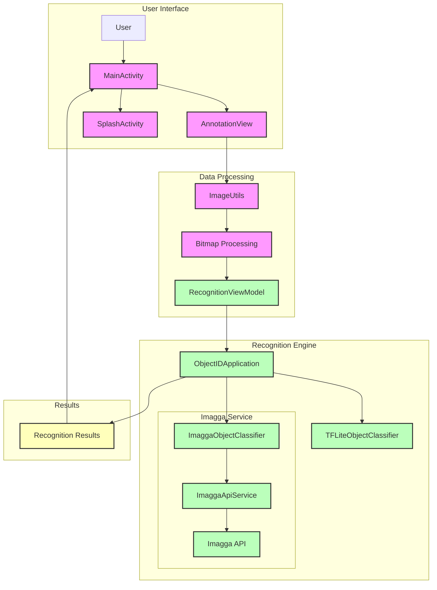

# ObjectID - System Diagrams

## Data Flow Diagram (DFD)



## Use Case Diagram

```mermaid
graph TD
    subgraph User
        User[User]
    end

    subgraph System
        A[ObjectID App]
    end

    subgraph Use Cases
        UC1[Capture Image]
        UC2[Select Image from Gallery]
        UC3[Annotate Object]
        UC4[Recognize Object]
        UC5[View Results]
        UC6[Retry Recognition]
    end

    %% Relationships
    User --> UC1
    User --> UC2
    UC1 --> A
    UC2 --> A
    A --> UC3
    UC3 --> A
    A --> UC4
    UC4 --> A
    A --> UC5
    UC5 --> User
    UC4 --> UC6
    UC6 --> UC4

    %% Styling
    classDef user fill:#f9f,stroke:#333,stroke-width:2px
    classDef system fill:#bbf,stroke:#333,stroke-width:2px
    classDef usecase fill:#bfb,stroke:#333,stroke-width:2px

    class User user
    class A system
    class UC1,UC2,UC3,UC4,UC5,UC6 usecase
```

## Data Flow Diagram Explanation

The DFD shows the flow of data through the ObjectID application:

1. **User Interface Layer**:
   - User interacts with MainActivity and AnnotationView
   - SplashActivity handles initial app loading

2. **Data Processing Layer**:
   - ImageUtils handles bitmap processing
   - RecognitionViewModel manages recognition state

3. **Recognition Engine Layer**:
   - ObjectIDApplication coordinates between classifiers
   - TFLiteObjectClassifier for local recognition
   - ImaggaObjectClassifier for cloud recognition
   - ImaggaApiService communicates with the Imagga API

4. **Results Layer**:
   - Recognition results flow back to the UI
   - User receives feedback and can retry if needed

## Use Case Diagram Explanation

The Use Case Diagram shows the main functionalities of the application:

1. **Primary Use Cases**:
   - Capture Image: Take photos using device camera
   - Select Image from Gallery: Choose existing photos
   - Annotate Object: Draw rectangles around objects
   - Recognize Object: Process and identify objects
   - View Results: See recognition results

2. **Supporting Use Cases**:
   - Retry Recognition: Attempt recognition again if needed

3. **Flow**:
   - User can start with either capturing or selecting an image
   - After image selection, they can annotate objects
   - The system processes the recognition
   - Results are displayed to the user
   - If needed, user can retry the recognition process
